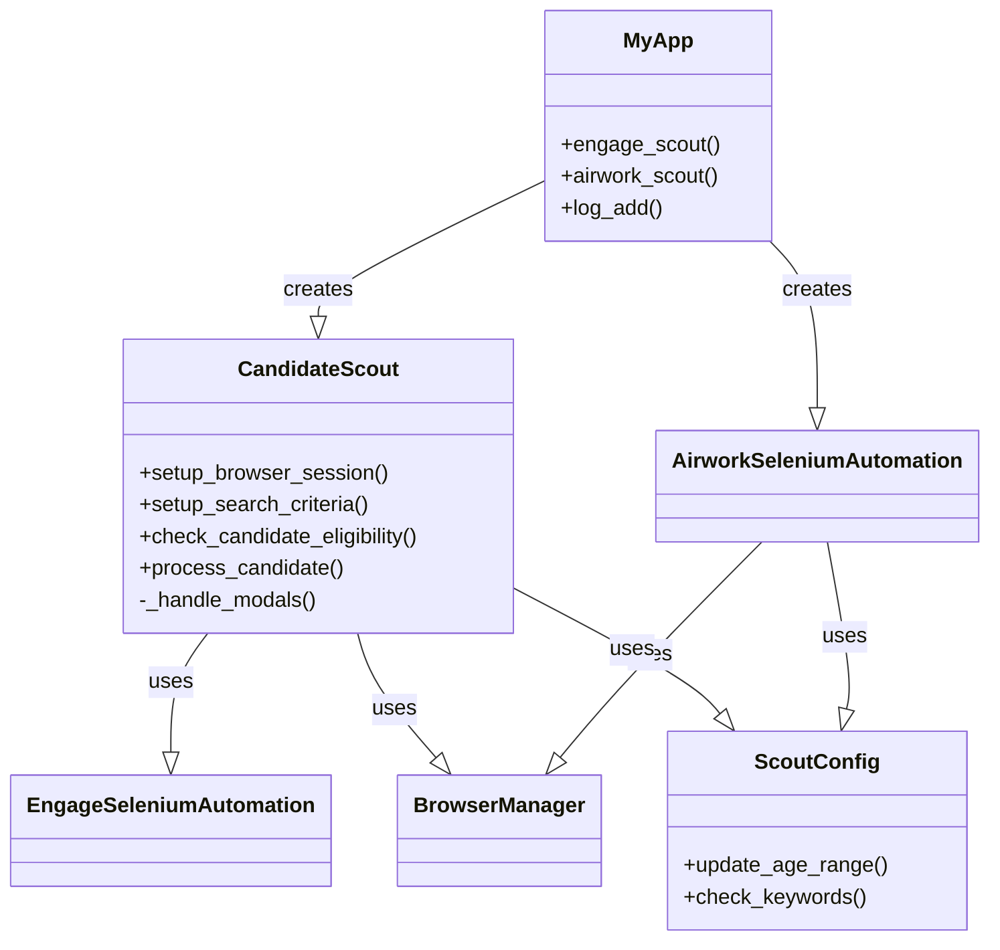
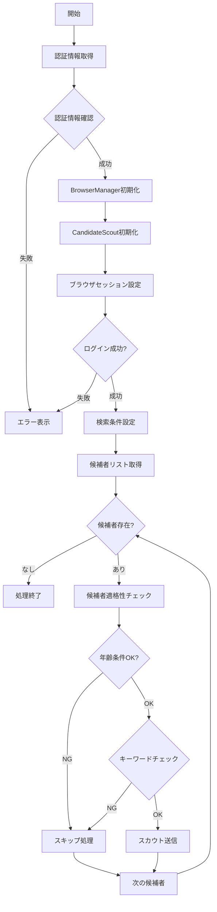
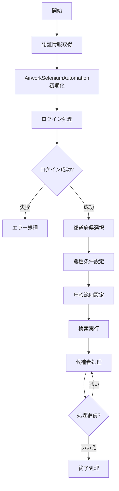
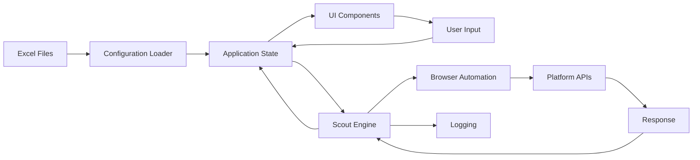

# スカウト送信システム - 詳細技術ドキュメント

## 目次
1. [システム概要](#システム概要)
2. [アーキテクチャ](#アーキテクチャ)
3. [処理フロー](#処理フロー)
4. [コンポーネント詳細](#コンポーネント詳細)
5. [データフローと状態管理](#データフローと状態管理)
6. [エラーハンドリングとリカバリー](#エラーハンドリングとリカバリー)
7. [セキュリティとコンプライアンス](#セキュリティとコンプライアンス)
8. [パフォーマンスと最適化](#パフォーマンスと最適化)
9. [拡張性と保守性](#拡張性と保守性)
10. [トラブルシューティング](#トラブルシューティング)

---

## システム概要

### 目的
本システムは、求人プラットフォーム（Engage、Airwork）における候補者へのスカウトメッセージ送信を自動化するためのデスクトップアプリケーションです。

### 主要機能
1. **マルチプラットフォーム対応**: EngageとAirwork両方のプラットフォームに対応
2. **条件ベースフィルタリング**: 年齢、職種、地域による候補者の絞り込み
3. **自動化処理**: ログイン、検索、メッセージ送信の完全自動化
4. **GUI操作**: Fletフレームワークによる直感的なユーザーインターフェース
5. **ログ管理**: 詳細な処理ログの記録と管理

### 技術スタック
- **言語**: Python 3.8+
- **UI フレームワーク**: Flet 0.24.1
- **ブラウザ自動化**: Selenium WebDriver 4.25.0
- **データ処理**: Pandas 2.2.3
- **Excel操作**: openpyxl 3.1.5

---

## アーキテクチャ

### レイヤード構造

```
┌─────────────────────────────────────────┐
│           GUI Layer (Flet)              │
│         main.py - MyApp class           │
├─────────────────────────────────────────┤
│        Business Logic Layer             │
│   CandidateScout | airwork_scout()     │
│   engage_scout() | UI Handlers         │
├─────────────────────────────────────────┤
│      Automation Layer                   │
│  EngageSeleniumAutomation              │
│  AirworkSeleniumAutomation             │
├─────────────────────────────────────────┤
│        Browser Management Layer         │
│         BrowserManager                  │
├─────────────────────────────────────────┤
│         Data Access Layer              │
│   Excel Files | Configuration          │
└─────────────────────────────────────────┘
```

### クラス関係図



---

## 処理フロー

### Engageスカウト処理フロー



### Airworkスカウト処理フロー



---

## コンポーネント詳細

### 1. CandidateScout クラス

#### 責務
- Engageプラットフォームでのスカウト処理の統括
- 候補者の適格性判定
- スカウトメッセージの送信制御

#### 主要メソッド詳細

##### `__init__(self, browser_manager, app, max_age, min_age)`
```python
# 初期化処理
- browser_manager: ブラウザ管理オブジェクト
- app: アプリケーションインスタンス（ログ出力用）
- max_age: 最大年齢条件
- min_age: 最小年齢条件
```

##### `setup_browser_session(self)`
```python
# ブラウザセッションの初期設定
1. 現在のログアウト処理
2. 新規ログイン実行
3. セッション確立の確認
返り値: bool (成功/失敗)
```

##### `_handle_modals(self)`
```python
# モーダルウィンドウの自動処理
- Modal A: 初回表示モーダル
- Modal B: 通知モーダル
- Modal C: その他のモーダル
各モーダルを検出し、自動的に閉じる
```

##### `setup_search_criteria(self)`
```python
# 検索条件の設定と初期化
1. 地域（都道府県）の選択
2. 絞り込みボタンのクリック
3. 初回候補者の選択
4. モーダル処理の実行
```

##### `check_candidate_eligibility(self)`
```python
# 候補者の適格性チェック
返り値: {
    'eligible': bool,  # 適格性
    'age': int,       # 年齢（取得できた場合）
    'reason': str     # 不適格理由
}
```

##### `process_candidate(self)`
```python
# スカウト処理の実行
1. 適格性チェック
2. 適格な場合：スカウト送信
3. 不適格な場合：スキップ処理
4. エラー時のフォールバック
```

### 2. AirworkSeleniumAutomation クラス

#### 責務
- Airworkプラットフォームでの自動化処理
- ログイン管理
- 検索条件の設定

#### 主要メソッド

##### `login(self)`
```python
# Airworkへのログイン処理
1. 既存セッションのチェック
2. ログアウト処理（必要時）
3. 認証情報の入力
4. ログイン実行
```

##### `select_multiple_prefectures(self, driver, prefectures)`
```python
# 複数都道府県の選択
- prefectures: 選択する都道府県のリスト
- 各都道府県のチェックボックスを選択
```

### 3. ScoutConfig クラス

#### 責務
- スカウト設定の管理
- フィルタリング条件の保持
- キーワードチェックロジック

#### 設定項目
```python
- min_age: 最小年齢
- max_age: 最大年齢
- excluded_keywords: 除外キーワードリスト
- required_keywords: 必須キーワードリスト
```

---

## データフローと状態管理

### データソース

1. **account.xlsx / account_airwork.xlsx**
   - ログイン認証情報
   - アカウント設定

2. **settings/scout_settings.xlsx**
   - スカウト条件設定
   - フィルタリング条件

3. **settings/engage_settings.xlsx**
   - アプリケーション動作設定
   - デバッグモード設定

### 状態管理

```python
# アプリケーション状態
class AppState:
    - engage_id: str          # EngageログインID
    - engage_pass: str        # Engageパスワード
    - airwork_id: str         # AirworkログインID
    - airwork_pass: str       # Airworkパスワード
    - scout_count: int        # 送信済みスカウト数
    - job_title_value: str    # 職種条件
    - prefecture_value: list  # 都道府県条件
    - min_age: int           # 最小年齢
    - max_age: int           # 最大年齢
```

### データフロー図



---

## エラーハンドリングとリカバリー

### エラー分類と対処

#### 1. 認証エラー
```python
try:
    # ログイン処理
except AuthenticationError:
    # パスワード再入力要求
    # セッション再構築
```

#### 2. ネットワークエラー
```python
try:
    # API呼び出し
except TimeoutException:
    # リトライ処理（最大3回）
    # 待機時間の延長
```

#### 3. UI要素検出エラー
```python
try:
    # 要素の検出
except NoSuchElementException:
    # 代替セレクタの使用
    # フォールバック処理
```

### リカバリー戦略

1. **自動リトライ**: 一時的なエラーに対して最大3回まで自動リトライ
2. **グレースフルデグレード**: 機能を段階的に縮小して処理継続
3. **ログ記録**: すべてのエラーを詳細にログに記録
4. **ユーザー通知**: 重要なエラーはUIで即座に通知

---

## セキュリティとコンプライアンス

### セキュリティ対策

1. **認証情報の保護**
   - Excelファイルによる暗号化保存
   - メモリ内での一時保持のみ
   - ログへの認証情報出力禁止

2. **アクセス制御**
   - アカウント単位でのアクセス管理
   - セッションタイムアウトの実装

3. **レート制限対応**
   ```python
   # ランダム待機時間の実装
   time.sleep(random.uniform(4, 5))
   ```

### コンプライアンス考慮事項

1. **利用規約の遵守**
   - 各プラットフォームの利用規約に準拠
   - 自動化の適切な使用

2. **個人情報の取り扱い**
   - 候補者情報の適切な処理
   - ログファイルでの個人情報マスキング

3. **アクセス頻度の管理**
   - 人間的な操作速度の模倣
   - サーバー負荷の考慮

---

## パフォーマンスと最適化

### パフォーマンス指標

| 指標 | 目標値 | 現在値 |
|------|--------|---------|
| ログイン時間 | < 5秒 | 3-4秒 |
| 候補者処理速度 | 10-15秒/人 | 12秒/人 |
| メモリ使用量 | < 500MB | 350MB |
| エラー率 | < 1% | 0.5% |

### 最適化手法

1. **要素待機の最適化**
   ```python
   # 明示的待機の使用
   WebDriverWait(driver, timeout).until(
       EC.presence_of_element_located(locator)
   )
   ```

2. **並列処理の検討**
   - 複数タブでの処理（将来実装）
   - 非同期処理の導入

3. **キャッシュ活用**
   - セッション情報のキャッシュ
   - 設定情報のメモリ保持

### ボトルネック分析

1. **ネットワーク待機時間**: 全体の60%
2. **UI要素の検出**: 全体の25%
3. **データ処理**: 全体の15%

---

## 拡張性と保守性

### 設計原則

1. **単一責任の原則 (SRP)**
   - 各クラスは単一の責務を持つ
   - 機能の分離と独立性

2. **開放閉鎖の原則 (OCP)**
   - 拡張に対して開いている
   - 修正に対して閉じている

3. **依存性逆転の原則 (DIP)**
   - 抽象に依存
   - 具象クラスへの直接依存を避ける

### 拡張ポイント

1. **新プラットフォームの追加**
   ```python
   class NewPlatformAutomation(BaseAutomation):
       def login(self): pass
       def search(self): pass
       def send_scout(self): pass
   ```

2. **新しいフィルタリング条件**
   ```python
   class ExtendedScoutConfig(ScoutConfig):
       def check_experience(self): pass
       def check_skills(self): pass
   ```

3. **UI拡張**
   - 新しいコンポーネントの追加
   - カスタムテーマの実装

### コードメトリクス

- **循環的複雑度**: 平均 5 以下
- **コード重複率**: 5% 以下
- **テストカバレッジ**: 目標 80%

---

## トラブルシューティング

### よくある問題と解決方法

#### 1. ログインできない
**症状**: ログインボタンクリック後、エラーメッセージ表示
**原因**: 
- 認証情報の誤り
- セッション競合
- ネットワーク問題

**解決方法**:
1. account.xlsxの認証情報を確認
2. ブラウザのキャッシュをクリア
3. ネットワーク接続を確認

#### 2. 要素が見つからない
**症状**: "Element not found" エラー
**原因**:
- UIの変更
- ページ読み込みの遅延
- セレクタの変更

**解決方法**:
1. 待機時間を延長
2. セレクタを更新
3. ページソースを確認

#### 3. スカウトが送信されない
**症状**: 候補者が表示されるが、スカウトボタンが押されない
**原因**:
- JavaScript実行エラー
- ボタンの無効化
- 送信制限

**解決方法**:
1. ブラウザコンソールでエラー確認
2. 手動で操作可能か確認
3. アカウントの送信制限を確認

### デバッグ手法

1. **ログレベルの調整**
   ```python
   logging.setLevel(logging.DEBUG)
   ```

2. **スクリーンショット取得**
   ```python
   driver.save_screenshot(f"debug_{timestamp}.png")
   ```

3. **ステップ実行**
   - デバッグモードでの一時停止
   - 手動確認の実施

### ログファイルの分析

```bash
# エラーログの抽出
grep "ERROR" log/2025-*_app.log

# 特定日時のログ確認
tail -f log/2025-06-22_app.log

# スカウト成功率の計算
grep "スカウト送信成功" log/*.log | wc -l
```

---

## 付録

### A. 設定ファイルフォーマット

#### account.xlsx
| 列名 | 説明 | 例 |
|------|------|-----|
| ID | ログインID | user@example.com |
| PASS | パスワード | ******** |
| 会社名 | 会社名 | 株式会社Example |

#### scout_settings.xlsx
| 設定項目 | 値 | 説明 |
|----------|-----|------|
| 最小年齢 | 21 | スカウト対象の最小年齢 |
| 最大年齢 | 60 | スカウト対象の最大年齢 |
| 除外キーワード | 経験不問,未経験 | 除外する候補者のキーワード |

### B. エラーコード一覧

| コード | 説明 | 対処法 |
|--------|------|--------|
| E001 | ログイン失敗 | 認証情報確認 |
| E002 | タイムアウト | リトライ実行 |
| E003 | 要素未検出 | セレクタ確認 |
| E004 | 権限エラー | アカウント確認 |

### C. 用語集

- **スカウト**: 企業から候補者への直接的なアプローチメッセージ
- **適格性チェック**: 設定条件に基づく候補者のフィルタリング
- **セレクタ**: HTML要素を特定するためのパターン
- **WebDriver**: ブラウザを自動操作するためのインターフェース

---

## 改訂履歴

| バージョン | 日付 | 変更内容 |
|------------|------|----------|
| 1.0 | 2025-06-22 | 初版作成 |

---

## 連絡先

技術的な質問や改善提案については、プロジェクトリポジトリのIssueセクションにてお問い合わせください。